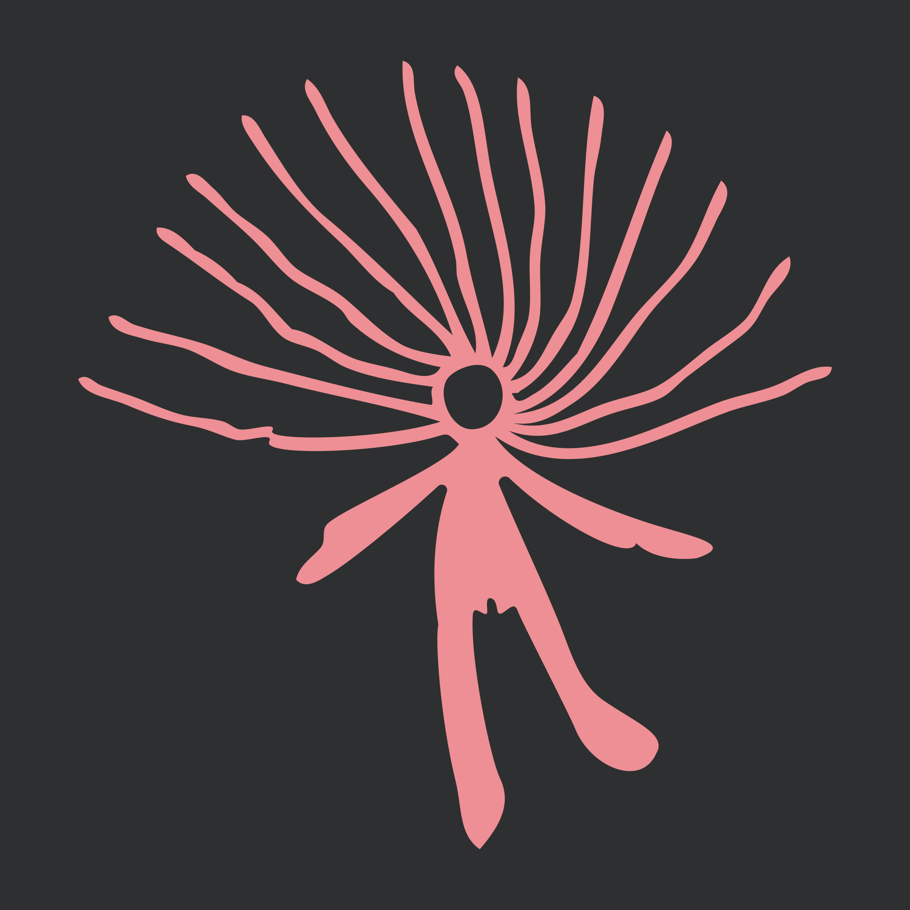

Based on an [*Aboriginal* rock engraving](https://commons.wikimedia.org/wiki/File:N%27Dhala_Gorge005a.jpg#/media/File:N'Dhala_Gorge005a.jpg), form [*N'Dhala Gorge*](https://en.wikipedia.org/wiki/N%27Dhala_Gorge_Nature_Park), that is based on a [drawing by Franz Gnaedinger](http://www.seshat.ch/home/ndhala.GIF) – showing two figures wearing a **rayed headdresses**. 

This is a [very early calendar](http://www.seshat.ch/home/calendar.htm) where every ray of the headdresses represent a fortnight (14 days).

The 14 rays of the woman (the pink figure) plus the 12 rays of the man (the green figure) are 26 rays that yield 364 days, while the circle of the woman's head represent the new year resulting a solar year of 365 days.

*The woman figure*

*The men figure*

