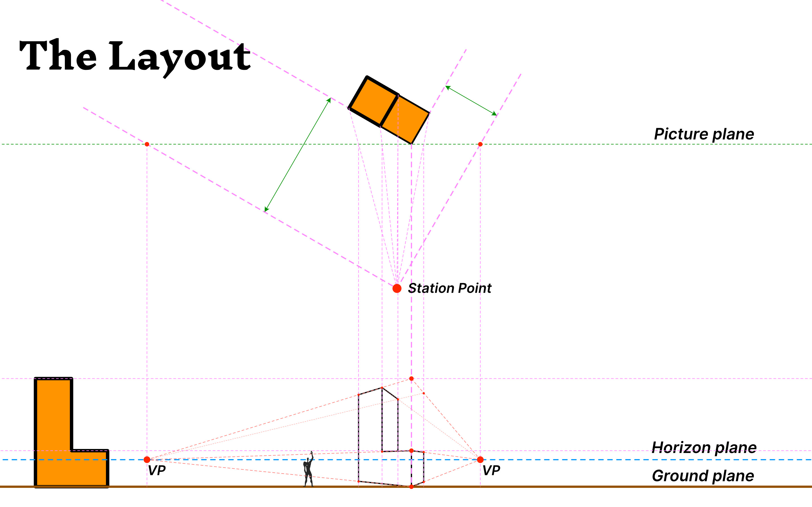

import LShape from '~/components/forPosts/LShape.vue'

import MyShape from '~/components/forPosts/MyShape.vue'

<MyShape/>
<LShape/>

## Why do perspective

My big brother studied some kind of engineering thingies when he was at Secondary school. As a kid I've used to observe while he did this isometric tricks - drawing 3d objects from plans and using simple tools like a sheet of paper, pencils and some rules. Him creating these shapes looked like magic - so as a good monkey, I've immediately started follow along - the amazing thing was - I was able the recreate the magic and it felt awesome 

In this tutorial we'll draw a simple shape using the laws of perspective. The **Law** in the of laws of perspective means that you'll be able to precisely reproduce the same view by using the same parameters - set your own view by demand -  to accurately create a perspective - and to create plans for other to read and use.

These drawings can be done manually with physical tools or by using a digital tool like I do, in this case Affinity Designer. You can also do it freehand - and though the precision levels will drop it will still be accurate.

*My old school drawing tools - See more photos [on this link](https://www.dropbox.com/sh/sg3sksjw4ghbaxx/AAA_2z7NT1M8qJ1UsmBdaB_Da?dl=0)*

BTW 

[What's the difference between accuracy and precision? - Matt Anticole](https://youtu.be/hRAFPdDppzs)

## Overview

Before we get started let's see how a finalized layout looks like, so you get a better idea of the project's scope - see it at **fig.layout**. I'll also be referring to some terms we'll be working with so I've listed them and added an image to show them in context (**fig.terms**).

### **List of Term**

**The 2D world**

- Plan view
- Elevation view
  
    - Height Helpers
- Ground plane
- Horizon plane

**The 3D world**

- Picture plane
- Station Point
- Vanishing Points
  
    - VP Helper
    - VP Crossing
- Projection Lines
  
    - PL crossing
- True Height
  
    - TH origin

*fig.layout - A basic layout for creating a perspective drawing*

---

*fig.terms - We'll get into further explanations as the article progress*

### **The example**

For this example let's choose a simple shape we probably all know from the game of Tetris - which I've spent too much time playing as a kind - one of the seven tetriminos will do (**fig.tetriminos**).

*fig.tetriminos*

# The 2D world

When modeling an object like house or a product designers and engineers use a 2d representation for simplicity sake - sometimes called a blueprint. These blueprints might have many views, for this article let's call them ***Plans*** (usually the top view) and ***Elevations*** (usually the side view).

The object I'll use will be the `L` tetrimino - Here's how it looks like as a blueprint - I've also added an isometric view to explain the views with ease.  A ***Plan*** view can be 1 of 2 sides - The Top or  Bottom. An ***Elevation*** view can be 1 of 4 sides → Front, Rear, Side and the other Side - in this case it's just a mirror reflection of the first side

*The block view*

## A basic layout

Let's review a basic layout to get a perspective drawing going -  To make a perspective we'll need 2 views - a ***Plan*** and an ***Elevation***. The elevation view will help us find the true heights of an object, the plan view will help us with everything else.

Rotating the plan view will result with a rotated 3d view 😉

*The Basic layout*

Use the views the holds most of the information in the clearer way - For the simple shape it doesn't really matter - As long as we use a ***Plan*** and an ***Elevation***

## The viewing planes - Height planes

These plans are using the elevation views

- **Ground plane** - As the name suggest, this is the ground and the base of the drawing
- **Horizon plane** - This is the viewer's eye level - In a counter intuitive kinda way, if you'de like to draw a **smaller** object then place the Horizon plane **higher** then the elevation view, and the other way around to draw a bigger object. The following fig *(Viewing planes, by object)* shows it nicely

*Viewing planes by viewer*

# The 3D world

This is where the flat views, the *plan* and the *elevation*, meet each other to create the 3d view. 

What is we'd like to draw the object large or small, see it through a wide or narrow lens This planes with 

### Picture plane

Line crossing the picture plane will be used to measure the true height

### Viewing height

Will start wh

### Station point - Distance, width and position

Is up to you where to place the Station point 

The station point is the distance of the viewer from the object. The closer the Station point to the object is the wider the image will be, and the other way around - the further away - the narrower it will turn out.

### Positioning

# Links

[3 point perspective tutorial.](http://www.automotiveillustrations.com/tutorials/drawing-3-point-perspective.html)