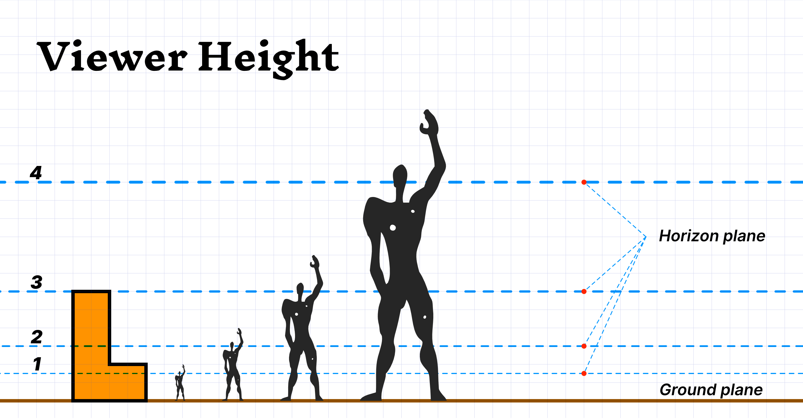

import LShape from '~/components/forPosts/LShape.vue'

## Why do perspective

As a young kis my big brother studied engineering thingies at Secondary school – his homework was to draw 3 dimensional shapes out of plans, and I used to observe him amazed while he did this isometric tricks – drawing 3d objects from plans by using simple tools; some rules, pencils and a sheet of paper. Him creating these shapes looked like magic – and as a good monkey I've immediately started to imamate – the amazing thing was that I was able the recreate the magic and it felt awesome!

*My old school drawing tools*

Along the years I've studied a *Practical Engineer Degree* in architecture and have fiddled around with 3D computer graphics – so I've homed my skills a bit further. But that was a long time ago and my 3D days are but a faded memory – or are they?! So I took out my drawing tools and started at it and failed miserably 😞 

What's a boy to do? I've *DuckDuckWent* it and a few days later I've had a proper drawing done ✍️ In order to not forget it I had this article done, in which we'll draw a simple shape using the **laws** of perspective. If by this article you'll know how to do these perspective drawing manually – with physical tools – or digitally, in this case, with *Affinity Designer* – it will be a great success!

!> The **Law** in the of laws of perspective means that there's a way to *precisely* reproduce the same view by using the same parameters – for you to set your oun views by demand, to *accurately* compose a perspective and to create plans for other to read and use. 

> BTW, ever wondered what's the difference between *accuracy* and *precision*? Then check out [this video by Matt Anticole](https://youtu.be/hRAFPdDppzs)

## The Setup

When modeling 3D objects like house or a chair – designers and engineers use 2d drawings for simplicity sake – to visually communicate how things function or constructed – these drawings are called a blueprints or floor plans, and they can have many views. In this article we'll use the **top** & **bottom** views (hereby *Plans)* and the **side/rear/front** and **other side** views (hereby *Elevations)*. 

For this example let's choose a simple shape we probably all know from the game of *Tetris* (which I've spent too much time playing as a kid). I'll use will be the `L` tetrimino – In the image below we can see all of the shape's views *(blueprint)* + an isometric view to explain the views with ease.  

!> In this article we'll be drawing a *Two-Point Perspective*. Another popular drawing is the *One-Point Perspective* while a more realistic depiction of real life is the *Three-Point Perspective*. 

*The L Block Tetrimino Views*

Before we get started – in the image below you can see how a finalized layout looks like, so you get a better idea of the project's scope. I've also marked the terms we'll be working and have listed them in the footnotes [^detailed-list].

 *An end result perspective drawing*

## Draw a Two-Point Perspective!

To get our perspective drawing going we'll need to set the object location and orientation + the viewer's height and viewing angle. We'll do that using 2 of the object's views – a *Plan View*[^1] and an *Elevation View*[^2]. Position the Elevation on the side and the Plan at the Top and in the middle we'll draw our perspective as seen in the image below (fig.layout-all).

 *fig.layout-all*
### Set the Side View (Elevation):

The *Elevation View* will help us find the object's heights

1. Draw the the *Ground Plane* [^3]
2. Place the *Elevation View* [^2] on it  
   > Choose a view the holds most of the information in the clearest way
3. Choose the viewer height by placing the *Horizon Plane* [^4]. In this drawing, the object is roughly 3 times the size of the viewer but we can have it which height we like. 
> Changing the viewer height will not change the output size, but the viewing angel. To change the output size you'll to use need smaller views.
3. Pull out the *Height Helpers* [^5] form the *Elevation View*. Draw them from the objects geometry

 *A basic layout showing the elevation side with the viewer height*

### Set the Top View (Plan):

Information from the *Plan View* will help us with getting all of the object's data:

1. The *Plan View* goes on the top of the layout, adjacent to the *Picture Plane* [^6]. Two things to keep in mind:
    - Make sure to leave enough space from the Elevation for the next step
    - For a *Two-Point Perspective* you'll need to rotate the Plan 
    - For a good looking and easy to draw result, rotate the Plan somewhere between 30° to 45°
    
        > Regular rules use these angles 📐 

    - Rotating the plan view will result with a rotated 3d view
    - Keep the Plan's outmost edge as the rotation point and tangent to the *Picture Plane*

2. Now let's place the *Station Point* [^7]. I'll place it smack in the middle for a mild perspective with a slight pan to left. 
3. To find the *Vanishing Points* [^8] scale and send parallel lines from the Plan view to up until the Station Point – The intersection of these lines with the Picture Plane are the *Vanishing Points Origin*.
4. Draw perpendicular lines form the Vanishing Points Origin to the Horizon Plane – The intersection of these lines are the *Vanishing Points*

*The Basic layout*

### Set the 3D view ‼️

1. The Plan View tangent point with the Picture Plane (from earlier), this point will crossing is the *True Height Origin* and will produce the *True Height Line*, that in conjunction with the *Height Helpers* will allow us to build the object precisely. 
2. Draw the *Picture Lines* [^10] from the Station Point to the objects edges in (the Plan View)
3. The intersection of the Picture Lines with the Picture Plane are the *Projection Lines* [^11] 
4. The intersection of the Projection Lines with the 

## To fixxxx

For you to make it freehand - and though the precision levels will drop it will still be accurate.

!> Use the views the holds most of the information in the clearer way - For the simple shape it doesn't really matter - As long as we use a ***Plan*** and an ***Elevation***

!> Check out the [3 point perspective tutorial.](http://www.automotiveillustrations.com/tutorials/drawing-3-point-perspective.html)
  
## Example

<LShape 
:show-comp-scale="true" 
:show-comp-pres="true"
:show-comp-rot-y="true"
:show-comp-axle-y="true"
/>

## Footnotes

[^detailed-list]: Our perspective drawing with all of the terms in use 

[^1]: ***Plan View*** – View from top or bottom

[^2]: ***Elevation View*** – View from whichever side

[^3]: ***Ground Plane*** – As the name suggest, this is the ground and the base of the drawing. 

[^4]: ***Horizon Plane*** – This is the viewer's eye level. The higher it is the taller the viewer is in relation the the object and vice versa. **BTW**, it can be below the *Ground plane* but it's probably won't produce a desirable output 

[^5]: ***Height Helpers*** – You'll draw them from the Elevation and they set the height of the element

[^6]: ***Picture Plane*** – This is where the magic happens – where we flip the 2D and the 3D worlds 😲 My recommendations; place it in the front or middle of the shape – meddling with it will produce undesirable outputs 

[^7]: ***Station Point*** – This will produce the perspective affect and they panning left or right. In a counter intuitive kinda way, having this point closer or further away will not make the object bigger or smaller – but like a camera lens – it will make the view *Wider* or *Narrower*. 

[^8]: ***Vanishing Points*** – This points will derive form your setup – You'll figure them up by using the *VP Helpers* and *VP Crossing*

[^10]: ***Picture Lines*** – Lines you'll draw from the *Station Point* to the object's edges, their crossing (***Picture Plane Crossing***) with the *Picture Plane* will produce the *Projection Lines* and the *True Height Origin*

[^11]: ***Projection Lines*** – Parallel lines you'll draw from the *Picture Plane Crossing* to the *Ground Plane*.  

[^9]: ***True Height Origin & Line*** - This is just another *Projection Line* that its origin is tangent to the *Picture Plane* – The line itself is used to measure an object true height using the *Elevation View* and the *Height Helpers*