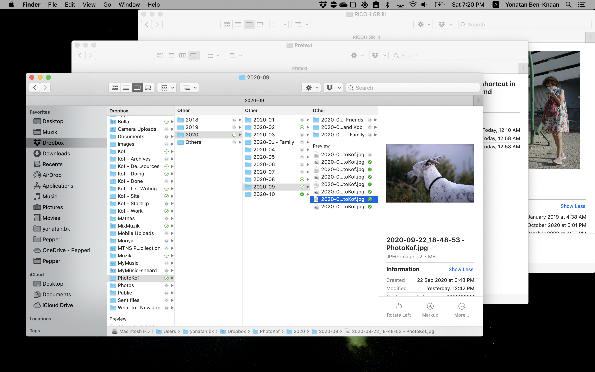
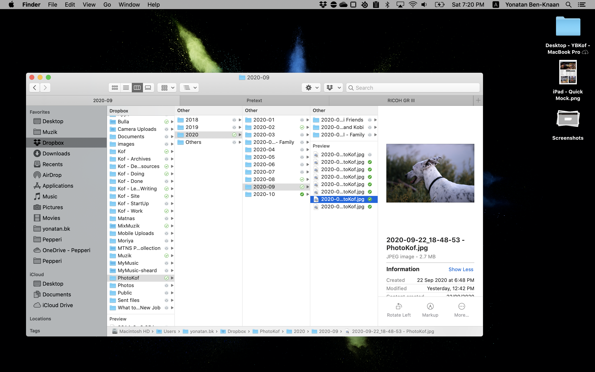

Lift($L$) can be determined by Lift Coefficient ($C_L$) like the following
equation.

$$
L = \frac{1}{2} \rho v^2 S C_L
$$

The macOS and the apps installed comes pack with sweet sweet shortcuts but not all is perfect. You might easily find yourself doing the same task over and over again by navigating and clicking items in menus unfitting to Fitts’s Law. Or even worse than that is that you didn't click that command because you where to lazy to navigate then damn menus - and by that hindering your workflow - which is already quite difficult. Such a shame...

## So what's the problem?

I guess that if you don't know how to create shortcuts for mac then here are two problems:

1. How do I set up a shortcut on macOS? 
2. And how do I make it specific for *Sketch*?
 
## Some jobs to be done

Here's two custom commands that can really improve your workflow, I'll use then as examples:

1. `Merge all window` - This command is relevant for **all** apps that are multi window: Let's say you find yourself with 7 open *Sketch* files and 6 *Finder* windows, and you're clicking like crazy trying to find the window you're looking for. Such an hassle. The `Merge all window` command is the best cleaner upper you'll get. It will merge all of your open windows [^fig.unmerged] into one window and shown as tabs [^fig.merged].
2. The next command is specific for *Sketch*: The issue with reviewing the *Layers* or *Components* panel on a big file. Of course you can scroll, it's nice, but sometimes you'd like the get an overview at a glance. That's why the `Collapse All Groups` command is good for. Unfortunately it has no shortcut 😢

Then let's learn how solve these problems and have a better workflow 🎉

## Create a custom macOS shortcut 

Let's start with the *Merge All Windows* command.
1. Open the *Keyboard* Preferences
   
   You can use the *Spotlight Search* with the `control` + `spacebar`, which is a great shortcut by *itself*, and start typing what your looking for. We're looking for the *Keyboard* Preferences, so I'll start typing `ke` [^fig.spot], then I'll see it as an option, click it! 
   
   You can also just look for it in the *System Preferences*, found in the Apple menu [^fig.apple_menu].
2. Select the *Shortcut* tab and click the *App Shortcut* on left panel [^fig.keyOS].
3. At the bottom of the right panel you'll see [`+`] and [`-`] buttons. Clicking the [`+`] button will open a prompt window [^fig.prompt].
4. In the prompt window you'll see a few inputs, leave the default `All Applications` in the *Application* dropdown.
5. Type in the `Merge all window ` command in Menu Title input. 
   
   !!! note Be mindful!
         You'll have to type the command name verbatim. That is **exactly** as it appears in the app's menu, including capital letters and spacing.
6. Type the shortcut you want into the *Keyboard Shortcut* input. You'll have to use a combination of a [modifier key/s and a regular key](#Modifier-&-Regular-Keys).
   
   For this shortcut I'll use the `ctrl` `option` `cmd` + `m` combination by typing them while in the input [^fig.filled-prompt].
7. Click `Add` button and there you have it! You've just created a costume shortcut for macOS 🧨 

Noice - now you can warp scatted windows like a boss and eliminate that document mess you call a desktop 🧹 

## Create a custom shortcut for *Sketch*

To do the `Collapse All Groups` command just repeat the previous flow with an exception on item number 4, which is: Pick *Sketch* at the Application dropdown [^fig.pick-app].

Obviously you'll need to type in the relevant command name and shortcut combination (I'm using  `ctrl` `option` `cmd` + `c`), but other then that the 2 use cases are the same. 

Once you've clicked Add you can get back to sketch and use this short cut to make your panel views look tidy and hospitable 🤓

---

## Pro tips

### Modifier & Regular Keys

Are their name suggest, modifier keys change the normal behavior of a key - It turns `1` into a `!` - Hell yeah! The available modifiers are; `ctrl`, `option`, `cmd` & `shift`. 

Regular key are the reset of the keys; A to Z, 1 to 0 and the special characters `!@#$%^&*()_+[];',./` that i  this case are also regular 😋.

### Wildcard shortcut 🃏 

Most apps on the macOS has a wildcard shortcut that allows to fussy search for you command just by typing it and return to it. It's the [*Help Menu*](https://support.apple.com/guide/mac-help/get-help-on-your-mac-hlpvw003/mac) available at the... wait for it... at the help menu. Just click `shift` +  `control` + `\` and the search will be waiting for your quick action which ever the app you're at 🏃

### Dealing with identical commands 👯‍♂️ 

Shortcuts in mac need to be unique. Let's take for example the `Left` command in *Sketch*, if you'll ever create a shortcut for it as explain above, it won't work. The reason is, this command ain't unique. You can find it both under `Text → Align → Left` and under `Arrange → Align → Left`. The app won't know which *left* you're referring to, so it will just diss you 😒 You'll have to make it unique for it to work, one way to do so is by adding its location. 

Let's brake it down: 
- `Text → Align → Left` [^fig.Text_Align_Left]
- `Arrange → Align → Left` [^fig.Arrange_Align_Left]
  
`Left` and `Align` are identical at both command - `Text` and `Arrange` are unique. So let's say you wanna shortcut the `Arrange` bit, so you'll need to copy the complete path by using the `dash` + `greater than` pattern to mark nest descent. So the left align arrange command needs to look like this: `Arrange->Align->Left` [^fig.unique], and there you have it, a command the is unique as a snowflake ❄️

I'll make sure the Application is on *Sketch* and for the shortcut I'll use the `ctrl` + `option` + `cmd` + `shift` + `→` and voila - a new shortcut is born 👶 

### Creating memorial shortcut 🤔 

Most probably that most of the short and "good" shortcuts are already taken by the OS, by the app you use or by the app's plugins (like in Sketch or VScode). 

Have a look at the Comma plugging for Sketch [^fig.comma], all of its commands are using a 3 modifier key combos. It' s taking up namespace and you can easily find yourself overriding or overwritten by some other shortcuts. 

A brut force way of dealing with this nuisance is using a 4 modifier key combo... `command` + `option` + `alt` + `shift` something - that ain't being used, thought I might by a nuisance by itself and is an extreme finger stretch for sure 🖖
    
Well, you're not the first to feel pain missing keys combos. Someone felt it before you and has created an app that will reassign the forgotten and mostly unused *Caps lock* key to emulate that 4 key press mentions above, effectively creating a brand new modifier key -> `tab` + key - Now that's easy to remember!

The app is called [Karabiner-Elements](https://karabiner-elements.pqrs.org) and it does much more then hacking the *Caps lock* key, but that’s why I'm using it for. Anyways, the reassigning the is quite easy. Let's see how its done: 

1. Install the app
2. Got the the *Complex modification* tab [^fig.Karabiner]
3. Click the *Add rule* button
4. In the prompt window click *Enable* on the 1st item from the example list called *Change the caps_lock to command+control+option+shift* [^fig.Karabiner_prompt]

That's it, you have it! Now you can add a command using all for 4 keys but clicking just the one key. So now, if you'd like to have the *Collapse All Groups* with `Caps lock` + `c`. Try it, it's nice.

Well, that's all for today. See you in the next post when we'll deal with the Sketch plugin short cuts

---

## This blogs images 
[^fig.unmerged]: Scattered finder windows 

[^fig.merged]: Same finder windows merged into one window shown as tabs 
 
[^fig.spot]: macOS Spotlight Search 
 
[^fig.apple_menu]: The Apple menu - You can fine the preferences menu here 

[^fig.keyOS]: macOS Keyboard Shortcut Manager 

[^fig.prompt]: A prompt widow to add command to an app 

[^fig.filled-prompt]: Added the command name and shortcut in the prompt 

[^fig.pick-app]: Make the shortcut specific by selecting an app 

[^fig.unique]: An example of a unique command using a the command’s path 

[^fig.comma]: Comma plugin banner taken form their Github Page 

[^fig.Text_Align_Left]: The text left align command 

[^fig.Arrange_Align_Left]: The arrange left align command 

[^fig.Karabiner]: The Karabiner app on the Complex modification tab - An Empty state 

[^fig.Karabiner_prompt]: A prompt window to enable the command+control+option+shift as *Caps lock* on Karabiner 