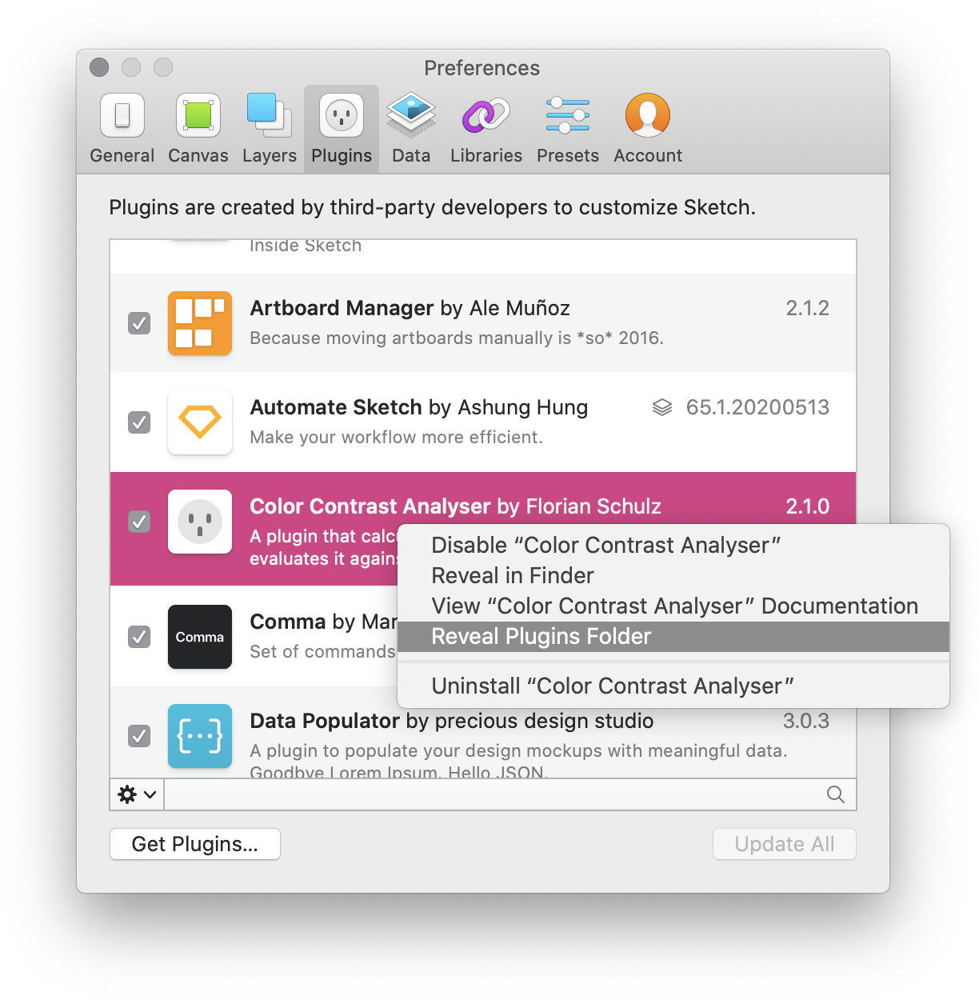
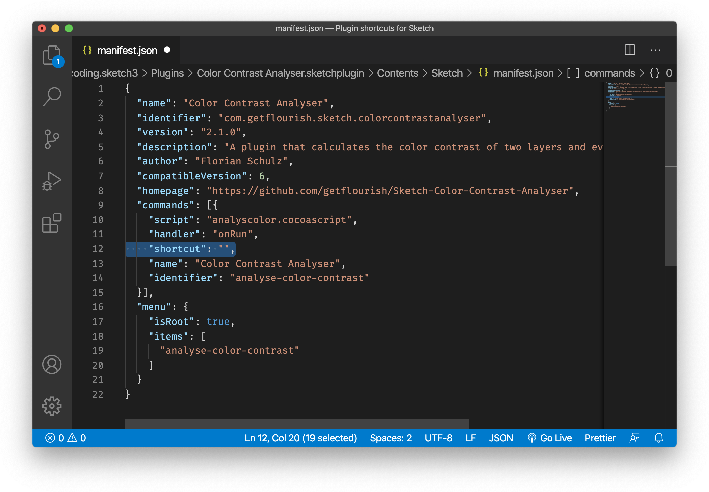

There's a thing you're doing all day long - moving your hands and cursor to control your apps - When you add up all these small movements you'll quickly end up whit a big wasteful repetition. You might have missed it because it's small. You might haven't deal with it because you don't know how - Whatever the reason you've let it slide, it's a wast of your time and **this post is for you!** 

# The painful movement of the hand
Seeing top notch developers working without lifting their hands form the keyboard made me think _is there a way for me to work that way?_ So elegant, so efficient, keeping your hands from a wrist infection. At around 2015 the answer was a **soft no** - I've customized every possible shortcut in _Illustrator_. The nicest thing about Illustrator shortcuts was the ease of creating and managing shortcuts with the `Keyboard Shortcuts` panel _(Fig.Ill)_. but some basic functionalities like resizing a shape wasn't available to begin with, so no shortcut could be assigned.


That same year it looked like *Sketch* was stable enough for production. One of the first things I've noticed that blow my mind when I've stated using it was the ability to resize shapes with stroke of some keys. **Amazing!** It made me feel that this product was build by my kind of people - at least, we share the same OCD. But unfortunately, there there was no easy way to manage keyboard shortcut in *Sketch*. Managing shortcuts on macOS *(fig.keyOS)* ain't a breeze too - beside being cumbersome it's unaware of existing Plugin shortcuts but even worst it doesn't allow you the select nested Plugin commands.

**In this article we'll review 2 ways to rectify the situation.**
- One is by using the macOS's keyboard panel
- The other in by using the plugin's `manifest.json`

We'll figure out the Jobs to be done, state the problem, go trough my solutions, cover some edge cases and install a tool that might help a little.  

Hope you guys enjoy it 🙆‍♂️ Let's go!

---

### Problem statement

macOS shortcuts works only for installed apps. Plugins are installed in the app, so the Keyboard Shortcut Manager won't work on them.  

1. How do I create a shortcut anyways?
2. How do I delete unwanted plugin shortcuts? 
3. How do I edit existing plugin shortcuts? 

# Jobs to be done

1. Recently I've installed the [Color Contrast Analyser for Sketch](https://github.com/getflourish/Sketch-Color-Contrast-Analyser), which a useful plugin if you'd like to make accessible products without leaving Sketch app for a solution online. The plugin ships without a shortcut and when working on a new design with a lot of contrast checking it can get real annoying real fast. As a keyboard fanatics I'd like to set a shortcut for it.
2. Some shortcuts are troublesome, let's say the [Comma plugin](https://github.com/margusholland/Comma). On the one hand I don't use it that often but on the other hand it holds a lot of valuable shortcuts (as you can see on *fig.comma*). I'd like to remove all these shortcuts because I might want to use them somewhere else and I also keep clicking them by mistake **all** the fricking time 😤

   There are two Comma shortcuts I'd like to keep while using a different key combo.


---

# The solutions

As mentioned, the macOS's shortcut manager won't work for an app plugin, in order to create a custom shortcut for  plugins we'll use the plugin's `manifest.json` file that can be found inside the plugin. 

> Every plugin is a `.sketchplugin` file but under the hood it's actually a folder on you computer, and in that folder the `manifest` resides.

So how do we do it?

1. Find the plugin

   The easiest way to locate the plugins folder is by opening *Sketch*'s Preferences panel (`⌘`+`,`) and under the *Plugins* tab click the *Reveal Plugin Folder* in the contextual menu (*fig.preferences panel*). 
   
   Another way is by using using the finder to navigate to the folder, usually to be found in this path; `Users ► {user name} ► Library  ► Application Support  ► com.bohemiancoding.sketch3 ► Plugins`   

2. Locate and open the file 
   
   Every plugins is a file with the `.sketchplugin` suffix and the file you're looking for will a name that is similar or identical to the plugin name. 
   
   These files are actually enclosed folders and right clicking them will reveal the `Show Package Contents` command in the contextual menu. Click it! (*fig.plugin folder*).
   
3. Find the manifest file
   
   Being a package means that and behind the scenes the plugin is a set of folders and files - some plugins holed many and some just a few. 
  
   Anyways, once we're in the package content we'll look for a file called `manifest.js`, usually to be found in `... ► Contents ► Sketch`.  When you locate it open it using a text editor - I'm using VS code but you can use TextEdit or whatever text or code editor you like (*fig.manifest*).

4. Edit the `manifest.js` file
   
   We're looking for the `shortcut` key/value pair - where the key is the title and value, that is now empty, will be the shortcut combo itself (*fig.empty shortcut*). 

   Now let's type the combo - I'd like it to be `ctrl` + `option` + `cmd` + `shift` + `c` combo to get plugin running, but you can use any modifier key combination you'd like. Save the file and now the shortcut should be available in Sketch *(fig.with shortcut)*.

5. Save the file and enjoy it in *Sketch*

 *fig.preferences panel*

 *fig.plugin folder*

 *fig.manifest*

 *fig.empty shortcut*

 *fig.with shortcut*

---

## Pro tips

### Duplicated shortcuts

Using the same shortcut for more then one action is a pain we have to live with. Unfortunately there's no nice solution that addresses this issue - and [the one that was has been discontinued](https://github.com/exevil/Keys-For-Sketch). My solution is daed simple → use uncommon patterns like `ctrl` `option` `cmd` and when they run out then use `ctrl` `option` `cmd` `shift`. Now clicking so many buttons might be annoying, to get around that I'm using [Karabiner Elements](https://karabiner-elements.pqrs.org/), it enables me to to re-map the `caps lock` as if I'm pressing all the 4 keys together. 

Here's a link to a simple guide to get this hack going by **How-To Geek** - [How to Turn Your Mac’s Caps Lock into an Extra Modifier Key](https://www.howtogeek.com/409904/how-to-turn-your-mac%E2%80%99s-caps-lock-into-an-extra-modifier-key/). Nice hack, thanks internet!

### Updating a plugin

Unfortunately updating a plugin will **reset** your shortcuts :-( As mentioned, there's no proper way to manage shortcuts 😤

### Edit a shortcut

In this article we've added a short cut, bet using this process we edit existing or delete unwanted shortcuts.

Editing is dead simple, just type the desired *value*

```json
"shortcut": "ctrl option l"
```

```json
"shortcut": "shift option l"
```

---

### Remove a shortcut

Deleting a shortcut can be done by removing just the *value,* not minding the *key.*

```json
"name": "God is love",
"identifier": "god_is_love",
"script": "God_Is_Love.js",
"shortcut": ""
```

Or by removing the *key/value pair* altogether

```json
"commands": [
    {
      "name": "God is love",
	  "identifier": "god_is_love",
      "script": "God_Is_Love.js"
    },
  ]
```

---

### No shortcut key/value pair?

Conversely, you can add a shortcut *key/value pair* if none exist, like in the case of the [Automate-Sketch](https://github.com/Ashung/Automate-Sketch) plugin.

> Mind the position of the `,` so you won't mess things up. The logic is simple - don't place a *comma* at the end of a curly bracket.

---

## Take aways

1. **Save time**

    Using a shortcuts might save a few second here and there instead of using the mouse or trackpad when reaching to a command in the UI. The deal is - when working  full time, all day long it might save you minutes a day and up to few hours a month.

2. **Better workflows**

    These commands are additional tools in our box, and tools we use shape the way we think.

3. **Take control** 

    Our brain is plastic and it bends in certain way - When we use our memory to trigger a command instead of lookin for it in the UI we improve our chances to form a clearer path to the command and us using it. We're bound to the way we do things